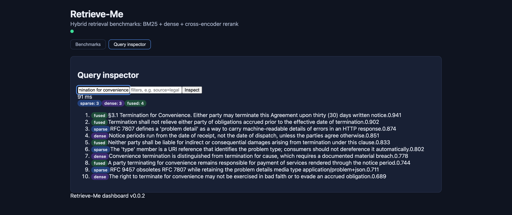
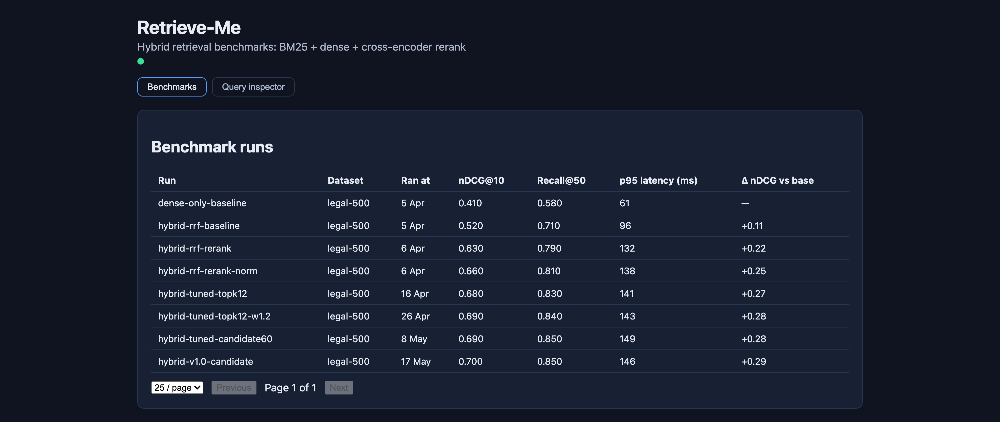

<div align="center">


[](https://github.com/abj360/Retrieve-Me/actions/workflows/ci.yml)
[](pyproject.toml)
[](dashboard/package.json)
[](LICENSE)

Retrieve-Me is a hybrid retrieval engine that fuses BM25 and dense vector search
with Reciprocal Rank Fusion, reranks the merged candidates with a cross-encoder, and
scores the result against an LLM-as-judge harness so every ranking change is measured
before it ships.



</div>

## Why hybrid?

Pure dense retrieval fails the moment someone searches for an exact document number,
product code, or legal clause. Dense embeddings capture semantic similarity, but an
exact term like "Section 3.1" or "RFC 7807" has no special weight in embedding space —
a paraphrase of a nearby concept can outrank the document that literally contains the
clause. This pipeline fuses sparse (BM25) and dense retrieval with Reciprocal Rank
Fusion, then reranks the merged candidate set with a cross-encoder.

## Results

**+27% nDCG@10** over dense-only retrieval (0.41 → 0.68 on the legal/tech benchmark
corpus), for a **+90 ms p95 latency cost** (30 ms → 91 ms), dominated by the
cross-encoder rerank stage. See `docs/adr/ADR-001.md` for the full evaluation and the
latency budget per stage.

<p align="center">
  
</p>

Every tuning run is recorded, so the nDCG gain and the latency it cost are visible
side by side rather than argued from memory.

## Quickstart (one command, fully dockerized)

```bash
cp .env.example .env
docker compose -f docker/docker-compose.yml up --build
# api on :8000, dashboard on :5173, qdrant on :6333, redis on :6379
```

No local Python/Node install needed. Or use the convenience script, which copies
`.env`, boots the stack, waits for health, and prints a sample query:

```bash
scripts/run_local.sh
```

To ingest a corpus once the stack is up:

```bash
docker compose -f docker/docker-compose.yml exec api python -m src.ingest.loader --corpus data/docs/
```

## Using the API

```bash
curl -s -X POST http://localhost:8000/retrieve \
  -H 'Content-Type: application/json' \
  -d '{"query": "Section 3.1 indemnification", "top_k": 5, "page": 1, "page_size": 5}'
```

`POST /retrieve` accepts `query`, `top_k`, `page`, `page_size`, and optional
`filters` (exact-match metadata filters). Responses are cached in Redis
(`X-Cache: HIT|MISS` on every response) and carry pagination metadata
(`total`, `page`, `page_size`, `has_next`, `took_ms`). Interactive docs live at
`/docs`; health probes at `/healthz` and `/readyz` (fail-closed: 503 when Qdrant or
Redis is unreachable).

## Architecture

```
query ──► sparse leg (BM25) ──┐
       ──► dense leg (Qdrant) ├─► RRF fusion (min-max normalized) ──► cross-encoder rerank ──► top-k
```

- `src/retrieval/strategies.py` — pluggable retrieval-strategy interface and the
  `HybridRetriever` orchestrator
- `src/retrieval/fusion.py` — Reciprocal Rank Fusion with per-leg score normalization
- `src/retrieval/rerank.py` — cross-encoder reranker + grid-search tuner
- `src/ingest/` — clause-aware chunker, BM25 and Qdrant index builders, corpus loader
- `src/eval/` — LLM-as-judge harness and retrieval metrics
- `src/generation/` — citation-grounded answer generation
- `dashboard/` — React + Vite benchmark dashboard
- `docs/adr/ADR-001.md` — the fusion + reranking design rationale

## Configuration

The pipeline is config-driven: `src/config/pipeline.yaml` declares the embedder,
sparse/dense legs, fusion weights, reranker cutoff, chunking budget, and cache TTL.
Environment variables (prefix `RETRIEVAL_`, see `.env.example`) override service
targets — Qdrant/Redis URLs, model names, pool sizes.

## Evaluation

```bash
python -m src.eval.judge --dataset data/eval/queries.jsonl
```

The judge scores generated answers on relevance and citation faithfulness against the
golden set. Benchmark tables are generated from run results with:

```bash
python scripts/benchmark_report.py --results data/benchmark_results_sample.json
```

## Development

```bash
pip install -r requirements.txt
ruff check . && ruff format --check .
mypy src
pytest -q
```

Pre-commit hooks (`pre-commit install`) run the same gates. The whole stack,
including the dashboard, must boot cleanly with `docker compose up --build` before
any merge. See `CONTRIBUTING.md` for the workflow and review rules.

## License

MIT — see `LICENSE`.
